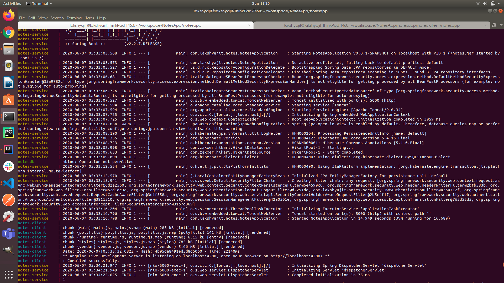

# NotesApp

A simple crud app to demonstrate JWT Authentication and dockerization(using Angular, SpringBoot and MySQL)

## Steps to run the app

 - The entire app(both frontend and backend has been dockerized)
 - Go to the root directory and type `docker-compose up --build`
 - This is will build and run the containers.
 - After all the containers are started, you will get a screen like this.
 - 
 - Since this app uses role based authentication, we need to insert those roles into the table
 - After the docker containers are up, go to the terminal and type the following:
  - `docker exec -it notesdb bash` (makes you enter the mysql bash)
  - `mysql -uroot -proot` (default username and password, gives you access to the mysql terminal)
  - `INSERT INTO roles(name) VALUES('ROLE_USER');`
  - `INSERT INTO roles(name) VALUES('ROLE_ADMIN');`
 - That's it. The app is now ready to use!
